<p align="center">
  
</p>

<h1 align="center">Shelvarr</h1>

<p align="center">
  <strong>A self-hosted home for your books and comics, in the *arr mould.</strong>
</p>

<p align="center">
  <a href="./LICENSE"></a>
  <a href="https://github.com/markcipolla/Shelvarr/actions/workflows/docker-publish.yml"></a>
  
</p>

Shelvarr looks after the ebooks and comics you already have: it scans them in,
matches their metadata, groups them into series, shows you what's missing, and
files everything under a naming scheme you choose. For comics it goes further
and fetches the missing issues itself. You can read in the browser, or on your
phone with [Stackarr](#android-app), the companion Android app.

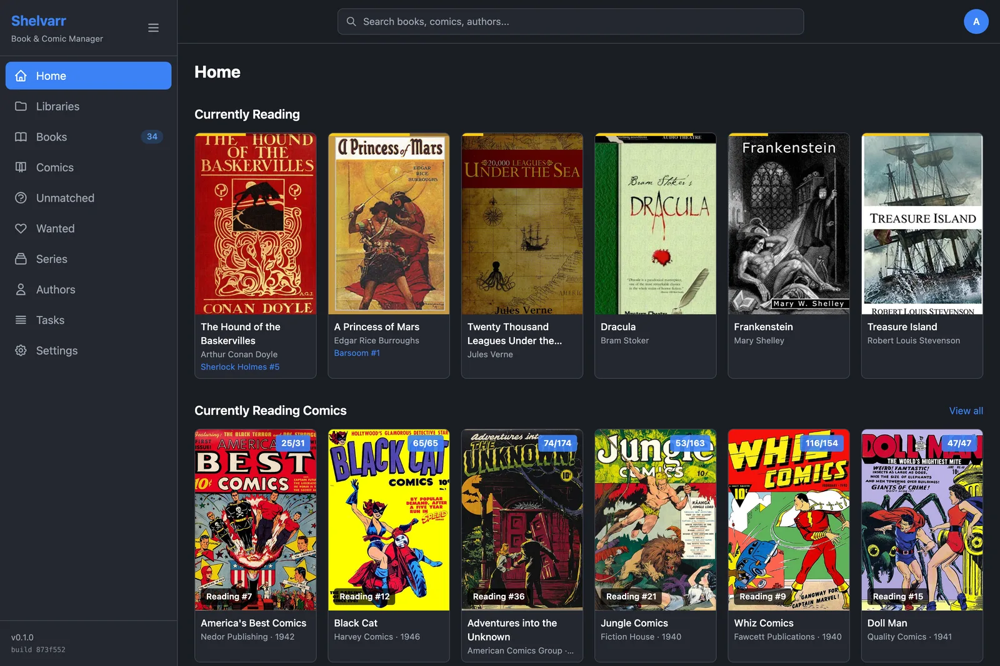

## Features

**Books**

- **Scan your library.** Point Shelvarr at a folder of epub, pdf, mobi, azw and
  azw3 files and it imports them.
- **Metadata from [Hardcover](https://hardcover.app).** Covers, descriptions,
  series and ISBNs, matched automatically — and fixed by hand when the match is
  wrong.
- **Series and authors.** Books group into series, and each author's
  bibliography comes from OpenLibrary, so you can see what you own and what
  you're missing.
- **Tidy files.** Rename and move books to a template, and find duplicates by
  file hash.
- **A wanted list.** Keep track of the books you're after and search Z-Library,
  Anna's Archive and Library Genesis for them.
- **Read anywhere.** An EPUB reader in the browser, with your place kept per
  person. Hardcover's reading statuses come across too.

**Comics**

- **ComicVine metadata.** Add a volume and Shelvarr creates its folder, pulls
  every issue, and adopts files already sitting there.
- **Downloads from GetComics.** Search for missing issues and Shelvarr queues
  them, resumes after a restart, falls back to other mirrors, and files what it
  fetches under your naming template.
- **Adopt an existing library.** Scan a folder tree Shelvarr has never seen and
  confirm its ComicVine matches.
- **Recurring jobs.** Nightly metadata refreshes, and an optional sweep for
  anything newly missing.

**Everything else**

- **Accounts without passwords.** Sign in with a code sent to your email, and
  everyone gets their own reading progress.
- **[Stackarr](#android-app) for Android.** Your library on your phone, with
  offline downloads, and it keeps itself up to date.
- **Diagnostics over MCP.** An optional read-only window onto logs and
  background jobs, for you or an AI assistant to debug with.

## Screenshots

<table>
  <tr>
    <td width="50%"><br><sub><b>Books.</b> Everything Shelvarr has scanned.</sub></td>
    <td width="50%">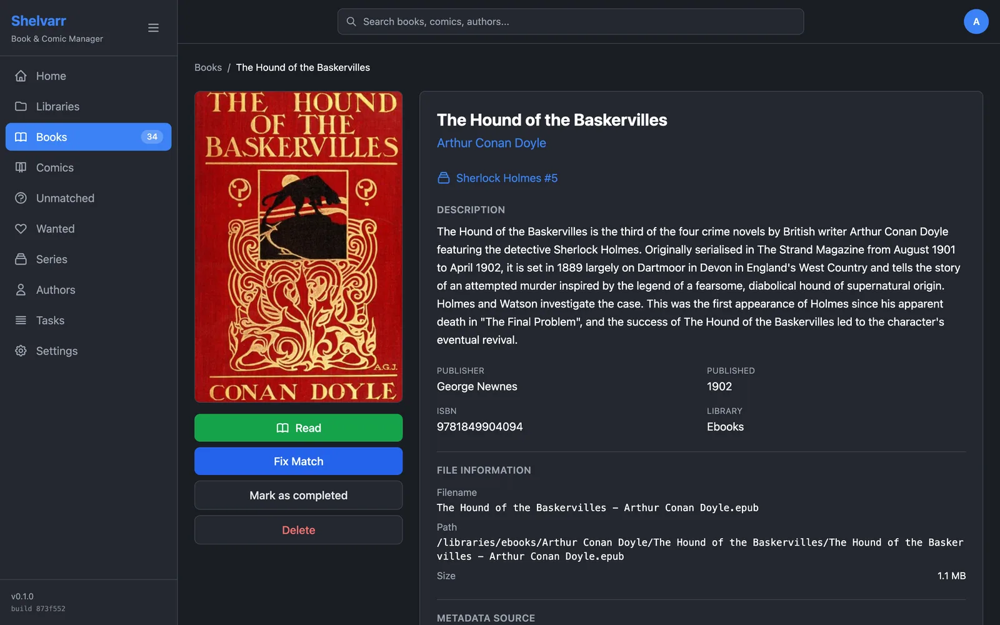<br><sub><b>A book.</b> Metadata, series and the file on disk.</sub></td>
  </tr>
  <tr>
    <td>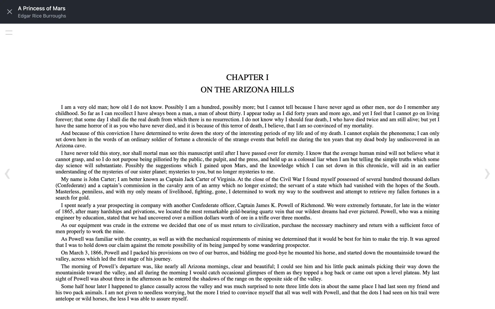<br><sub><b>The reader.</b> EPUBs open in the browser.</sub></td>
    <td>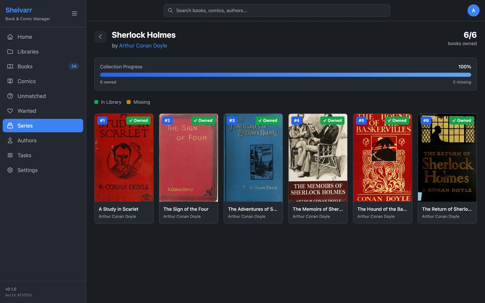<br><sub><b>A series.</b> In order, with what's missing.</sub></td>
  </tr>
  <tr>
    <td>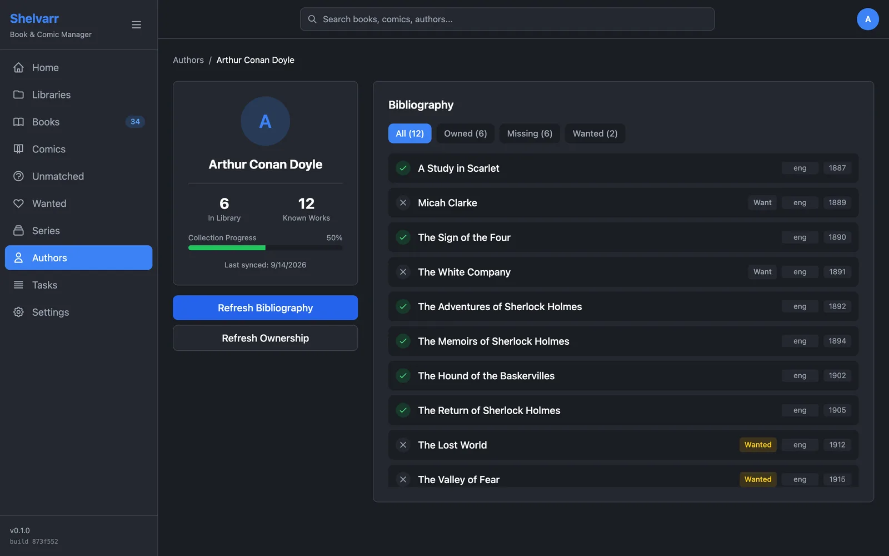<br><sub><b>An author.</b> Their bibliography, marked owned, missing or wanted.</sub></td>
    <td>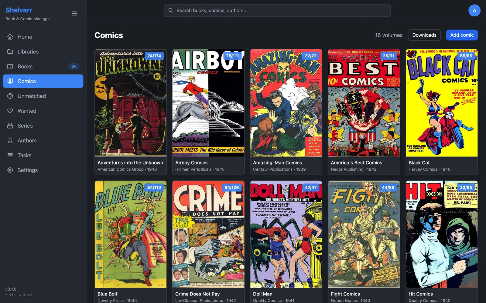<br><sub><b>Comics.</b> Each volume with how many issues you have.</sub></td>
  </tr>
  <tr>
    <td>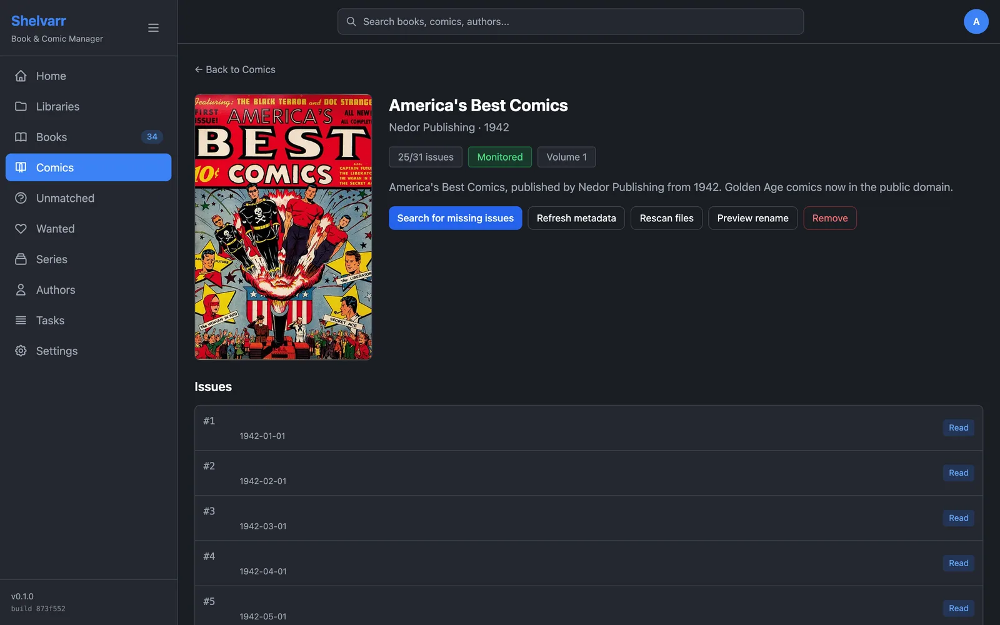<br><sub><b>A volume.</b> Search for missing issues, refresh, rescan and rename.</sub></td>
    <td>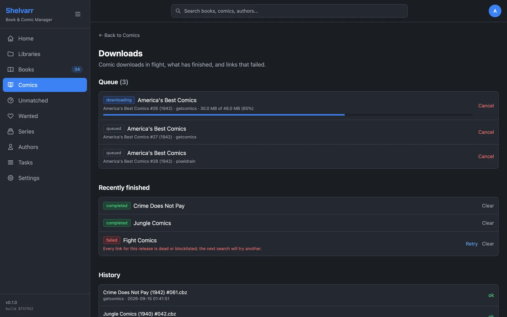<br><sub><b>Downloads.</b> The queue, what finished, and what failed.</sub></td>
  </tr>
  <tr>
    <td>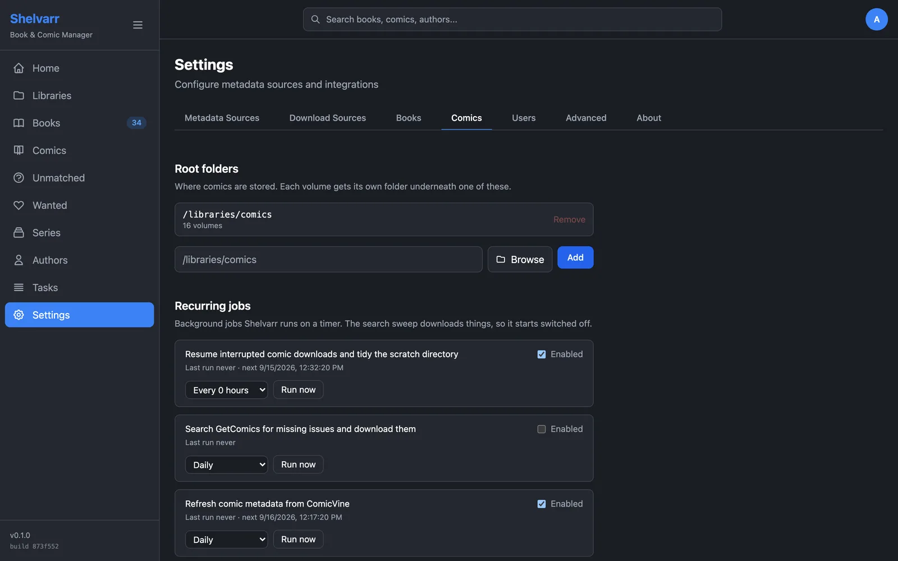<br><sub><b>Comic settings.</b> Root folders and recurring jobs.</sub></td>
    <td>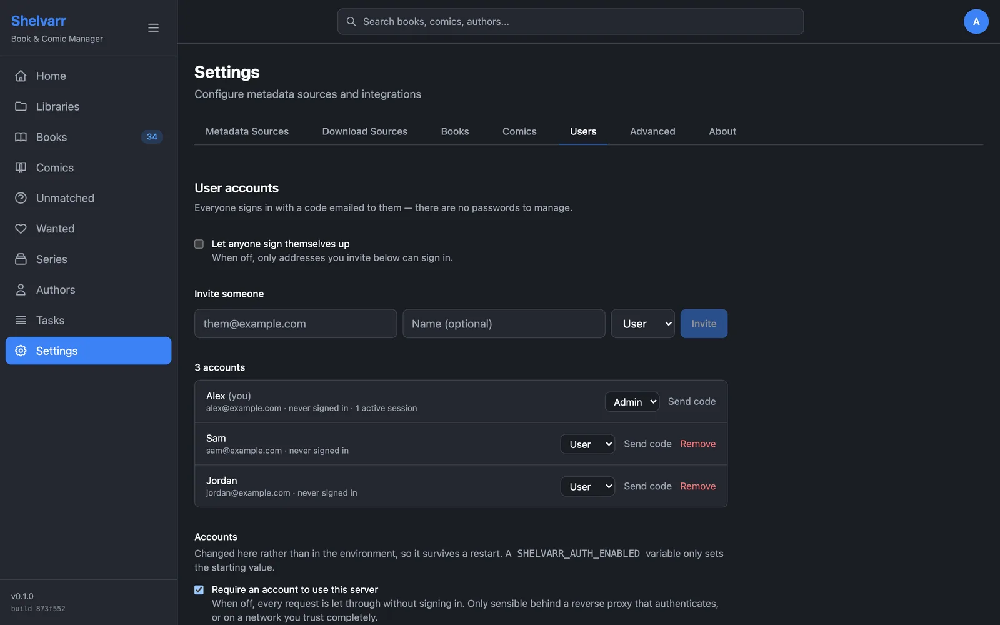<br><sub><b>Accounts.</b> Invite people; nobody has a password.</sub></td>
  </tr>
</table>

And [Stackarr](#android-app), on your phone:

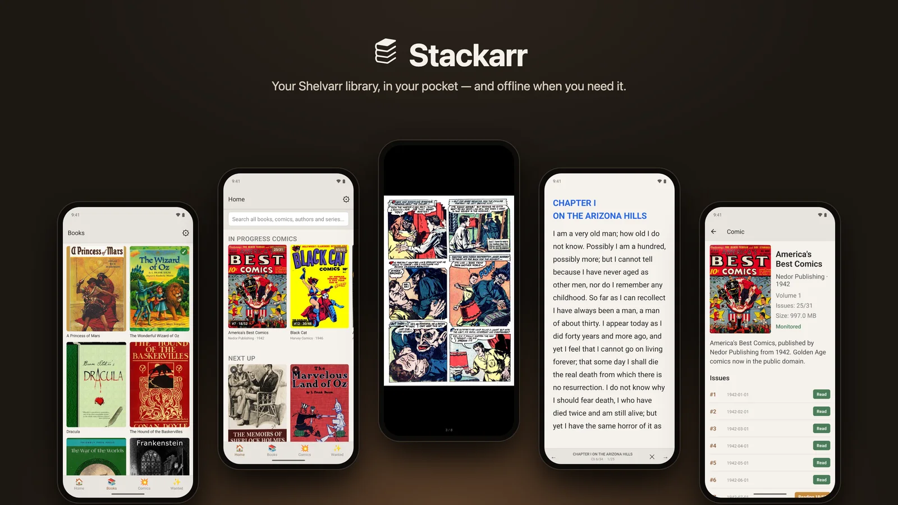

<sub>The screenshots show a demo library of public-domain books and Golden Age
comics, with covers from OpenLibrary and Wikimedia Commons, and one real issue
and one real novel to read. See
[Refreshing the screenshots](#refreshing-the-screenshots).</sub>

## Quick start

### Docker (recommended)

Create a `docker-compose.yml`:

```yaml
services:
  shelvarr:
    image: ghcr.io/markcipolla/shelvarr-web:latest
    container_name: shelvarr
    ports:
      - "3000:3000"
    volumes:
      - shelvarr_data:/app/data
      # Mount your book libraries:
      - /path/to/ebooks:/libraries/ebooks:rw
      - /path/to/comics:/libraries/comics:rw
    environment:
      # The user that owns your library folders — run `id -u` and `id -g`.
      - PUID=1000
      - PGID=1000
      - TZ=Australia/Melbourne
    restart: unless-stopped

volumes:
  shelvarr_data:
```

Then start it:

```bash
docker compose up -d
```

Open http://localhost:3000. The first visit runs a setup wizard that creates
your admin account. From there:

1. **Settings → Metadata Sources**: add a [Hardcover](https://hardcover.app)
   token for books and a [ComicVine](https://comicvine.gamespot.com/api/) key
   for comics.
2. **Libraries**: add `/libraries/ebooks` and scan it.
3. **Settings → Comics**: add `/libraries/comics` as a root folder, then add
   volumes from **Comics → Add comic**, or adopt the ones already there.

[`docker-compose.ghcr.yml`](./docker-compose.ghcr.yml) is a fuller example with
every setting, and [`.env.example`](./.env.example) shows how to set them from
a `.env` file.

### Build from source

```bash
git clone https://github.com/markcipolla/Shelvarr.git shelvarr
cd shelvarr
docker compose up -d
```

## Configuration

### File ownership

Shelvarr writes into your library when it imports a comic, so the container has
to run as a user that is allowed to. Set `PUID`/`PGID` to the owner of your
library folders — `id -u` and `id -g` on the host — and the container adjusts
itself to match on startup. Get it wrong and imports fail with:

```
Cannot write to /libraries/comics/Some Series as uid 1001:1001: grant
uid 1001:1001 write access to that folder, or set PUID/PGID to the user
that owns your library.
```

| Variable | Default | Description |
|----------|---------|-------------|
| `PUID` | 1001 | Uid the server runs as |
| `PGID` | 1001 | Gid the server runs as |
| `UMASK` | 022 | Permissions imported files are created with; `002` shares them with the group |

Setting `user:` in your compose file works too, and takes precedence — but then
nothing adjusts `/app/data` for you, so it has to be writable by that uid
already.

### Timezone

| Variable | Default | Description |
|----------|---------|-------------|
| `TZ` | UTC | IANA zone name, e.g. `Australia/Melbourne` |

Dates the server renders — "last synced", "added" and the like — follow `TZ`.
Stored timestamps and the server log stay UTC, so changing this re-reads your
existing library rather than rewriting it.

### Environment variables

| Variable | Default | Description |
|----------|---------|-------------|
| `PORT` | 3000 | Server port |
| `DATA_DIR` | ./data | Data directory for SQLite database and app files |
| `DB_PATH` | `$DATA_DIR/shelvarr.db` | The SQLite database itself |
| `LIBRARY_ROOT` | /libraries | Where the folder browser starts when you add a library |
| `GETCOMICS_URL` | https://getcomics.org | GetComics base URL (change to use a mirror) |
| `GETCOMICS_DOWNLOAD_DIR` | `$DATA_DIR/downloads` | Scratch directory for in-flight comic downloads |
| `GETCOMICS_HOST_PREFERENCE` | getcomics,pixeldrain | Order to try download hosts in |
| `GETCOMICS_RENAME` | true | Rename imported files to the naming template; set `false` to keep original names |
| `SCHEDULER_ENABLED` | true | Set `false` to stop Shelvarr running recurring jobs in-process |
| `COMIC_PATH_MAP` | - | `from:to` prefix remap, when a library's recorded paths differ from where this process sees them |
| `LOG_LEVEL` | info | Lowest level written to the log, and so to the buffer the diagnostics API reads |
| `LOG_BUFFER_SIZE` | 2000 | Recent log lines held in memory for the diagnostics API |

API keys are not environment variables: Hardcover and ComicVine keys are entered
under **Settings → Metadata Sources**, and comic downloads go into the root
folders set up under **Settings → Comics**. `HARDCOVER_API_TOKEN`,
`COMICVINE_API_KEY` and `COMIC_LIBRARY_ROOT` used to be read too, and no longer
are — if you set them, enter the same values in Settings.

#### Accounts and email

| Variable | Default | Description |
|----------|---------|-------------|
| `SHELVARR_AUTH_ENABLED` | true | Starting value for accounts; the toggle in **Settings → Users** wins once an admin has set it. `false` leaves the server open |
| `SHELVARR_ALLOW_SIGNUP` | false | Starting value for self-signup; the toggle in **Settings → Users** wins once an admin has set it |
| `SHELVARR_LOGIN_CODE_TTL` | 600 | Seconds an emailed sign-in code stays valid |
| `SHELVARR_SESSION_TTL` | 2592000 | Seconds a browser session lasts (30 days) |
| `SHELVARR_NATIVE_SESSION_TTL` | 31536000 | Seconds a Stackarr session lasts (1 year) |
| `SMTP_HOST` | - | Mail server for sign-in codes. Without it, codes are written to the server log instead. **Settings → Users** wins once an admin saves mail settings there — as it does for every `SMTP_*` below |
| `SMTP_PORT` | 587 | Mail server port |
| `SMTP_SECURE` | port is 465 | Implicit TLS. Leave unset unless your server disagrees with the default |
| `SMTP_USER` | - | Username, if the mail server needs one |
| `SMTP_PASSWORD` | - | Password for `SMTP_USER` |
| `SMTP_FROM` | Shelvarr &lt;shelvarr@localhost&gt; | Address sign-in emails come from |

## Accounts

Shelvarr requires a sign-in by default. **Existing installs will be locked out
on first start after upgrading** until an admin account is created — open the
app and the first-run wizard will take you through it.

If you would rather not have accounts at all — a trusted home network, or a
reverse proxy that already authenticates — set `SHELVARR_AUTH_ENABLED=false`,
or untick "Require an account to use this server" in **Settings → Users**
and everything is open again, exactly as it was before.

**No passwords.** Signing in means entering your email and typing back the
six-character code that arrives. A code works once and expires after ten
minutes, and is retired after five wrong guesses.

**First run.** With no accounts on the server, every page redirects to
`/setup`. That wizard creates the first account, always an admin, and signs you
in on the spot — so you can get in before SMTP is configured. Once the first
account exists the wizard is closed for good.

**Adding people.** By default nobody can sign themselves up: an admin invites
them from **Settings → Users**, which creates the account and emails a code.
Turn on *Let anyone sign themselves up* there if you would rather any address
could create its own account.

**Without email.** Sign-in codes can only be delivered once a mail server is
configured, either through `SMTP_HOST` or in **Settings → Users**.
Until it is, Shelvarr writes each code to the server log and shows invite codes
in **Settings → Users**, so a mail-less install is still usable — just manual.
Pass the code on, and the recipient enters it under *I already have a code* on
the sign-in screen.

**The app.** Stackarr signs in exactly the same way: enter your email, then
type the code from the mail into the row of boxes.

**API access.** The `api_key` setting still works for scripts, sent as
`X-API-Key` or as the password in basic auth. It grants access but no identity.
It is unset by default, and unlike before, leaving it unset no longer means the
API is open.

**Reading is per person.** Everyone gets their own read progress, so **Currently
Reading** and **Next Up** on the home screen — and the resume position in the
reader, on the web and in the app — follow you, not the server. Two people can
be on different issues of the same comic without moving each other's place.

With `SHELVARR_AUTH_ENABLED=false` there is nobody to tell apart, so reading is
shared across everyone, exactly as it was before accounts existed. Requests
using the `api_key` read and write that same shared progress, since the key
names nobody. When you create the first admin account, whatever the server had
already recorded comes with you — turning accounts on does not lose your place.

Two things stay server-wide by design: Hardcover, which is configured once with
a single account's token, and the green *read* tick that comes from it.

## Comics

Shelvarr manages comics itself — it does not need Kapowarr.

**Setup.** Add a ComicVine API key under **Settings → Metadata Sources**,
alongside Hardcover, and at least one root folder under **Settings → Comics**. A
key is free from [comicvine.gamespot.com/api](https://comicvine.gamespot.com/api/).

**Adding comics.** Search ComicVine from `/comics/add`. Shelvarr pulls the
volume and its issues, creates the folder, and adopts any files already sitting
there.

**Getting issues.** From a volume's page, *Search for missing issues* picks a
non-overlapping set of [GetComics](https://getcomics.org/) releases covering
what you're missing and queues them. Or run a manual search through the API to
see every release, ranked, with a reason on the ones that don't match.
Downloads stream to `GETCOMICS_DOWNLOAD_DIR`, get renamed to the naming
template, and land in the volume's folder. Supported hosts are GetComics' own
servers and Pixeldrain; DataNodes, VikingFile, TeraBox, Mega and MediaFire are
recognised and shown but not fetched — see [NOTICE.md](./NOTICE.md).

**When a download goes wrong.** The article's other links for the same issues
are recorded alongside the one being used, so a link that dies between search
and download falls through to the next mirror (and the dead one is
blocklisted). A host that rate-limits us is not treated as a failure at all:
the download goes back in the queue with its partial file intact and is retried
after a backoff, up to five attempts, resuming rather than starting over. Only
once those are spent does it fail — which is what lets the next search pick a
different release. Anything stopped can be started again with **Retry** on
`/comics/downloads`.

A download that a restart or crash interrupted is picked back up on its own:
live downloads leave a heartbeat, and a sweep under **Settings → Comics**
(every 15 minutes, on by default) requeues any that have gone quiet for half an
hour. Claiming is atomic, so it is safe with several server processes against
one database.

A download that fetched its bytes but could not file them away — a library
folder it has no permission to write to, most often — keeps them, so pressing
**Retry** after fixing the cause resumes instead of pulling the issue again.
The same sweep clears `GETCOMICS_DOWNLOAD_DIR` of anything nothing can use any
more: cancelled downloads, and failures nobody retried within two days.

**Keeping it tidy.** Per volume: refresh metadata from ComicVine, rescan files,
and preview-then-apply a rename to the naming template. Library-wide:
`POST /api/comics/tasks` with `updateAll` or `searchAll`.

**Recurring jobs.** Under **Settings → Comics**, a nightly ComicVine metadata
refresh runs by default. The GetComics sweep — search for every missing issue
and download what it finds — is there too but starts switched off, since it
downloads things unprompted.

### Adopting an existing library

For a folder tree Shelvarr has never seen, use **Settings → Comics → Import an
existing library**. That scans the tree and guesses the ComicVine match for each
folder — one search per folder, so it is slower — and you confirm the matches on
`/comics/import`.

If a volume's folder can't be found afterwards, set `COMIC_PATH_MAP` to map the
recorded path prefix onto the one this process sees, e.g.
`/comics-1:/libraries/comics`.

## Diagnostics API and MCP

**Settings → Advanced** has a checkbox that opens a read-only window onto the
running server: its logs, its status, and what its background jobs are doing.
It is off until you tick it, because logs contain file paths, search terms and
email addresses. Nothing it exposes can change your library.

Ticking the box mints an access token. Point Claude Code at the MCP endpoint
with it:

```bash
claude mcp add --transport http shelvarr http://localhost:3000/api/mcp \
  --header "Authorization: Bearer <token>"
```

That gives an assistant five tools: `get_status`, `search_logs`, `list_tasks`,
`get_task` and `list_comic_downloads`. The same data is available as plain
JSON for anything that would rather not speak MCP:

```bash
curl -H "Authorization: Bearer <token>" http://localhost:3000/api/admin/status
curl -H "Authorization: Bearer <token>" "http://localhost:3000/api/admin/logs?level=warn&limit=50"
curl -H "Authorization: Bearer <token>" "http://localhost:3000/api/admin/tasks?status=failed"
```

A signed-in admin's session works in place of the token, so the Advanced tab
can show a log tail without holding one. The shared `api_key` does not — this
is a narrower door than the rest of the API, and it takes its own key.

Logs live in a ring buffer in the server process, so a restart empties them and
only the last `LOG_BUFFER_SIZE` lines are kept. Set `LOG_LEVEL=debug` for more
detail.

## Android app

`apps/native` is an Expo app (Stackarr) that reads your Shelvarr library on a
phone, with offline downloads for books and comics, and EPUB, PDF and comic
readers built in. Grab the APK from the
[latest release](https://github.com/markcipolla/Shelvarr/releases/latest).

It is sideloaded rather than
shipped through the Play Store, so it keeps itself current: on each launch it
checks the repository's GitHub Releases for a newer version and offers to
download and install the release APK. **Settings → Updates** has a manual check
and shows the running version.

Publishing a new version is a version bump plus a `v*` tag — see
[apps/native/RELEASING.md](./apps/native/RELEASING.md) for the keystore setup
that in-place updates depend on.

## Development

Shelvarr is a pnpm monorepo on Node 24: the Next.js server in `apps/web`,
Stackarr in `apps/native`, and shared code under `packages/`.

```bash
pnpm install
pnpm dev                                # the web app on http://localhost:3000
pnpm test                               # unit and integration tests
pnpm --filter @shelvarr/web test:e2e    # Playwright; needs `npx playwright install chromium`
```

### Refreshing the screenshots

The screenshots above come from a demo library built by
[`apps/web/scripts/demo`](./apps/web/scripts/demo): public-domain novels and
Golden Age comics, one real EPUB and one real comic issue, three accounts, and
a download queue with something in every state. To retake them after a UI
change:

```bash
cd apps/web
pnpm build
export DATA_DIR=/tmp/shelvarr-demo
npx tsx scripts/demo/seed.ts

SCHEDULER_ENABLED=false \
  NODE_OPTIONS="--import=./scripts/demo/network.mjs --import=./tests/mocks/e2e-server.mjs" \
  npx next start --port 3917 > "$DATA_DIR/server.log" 2>&1 &

npx tsx scripts/demo/screenshots.ts
for shot in scripts/demo/out/*.png; do
  magick "$shot" -resize 1600x -quality 82 "../../docs/screenshots/$(basename "$shot" .png).webp"
done
```

Stackarr's come from an Android emulator pointed at the same server. Start one
with Stackarr installed — the APK from the latest release will do — then:

```bash
ANDROID_SERIAL=emulator-5554 npx tsx scripts/demo/stackarr.ts
npx tsx scripts/demo/stackarr-poster.ts
magick scripts/demo/out/banner/stackarr.png -resize 1600x -quality 84 ../../docs/screenshots/stackarr.webp
for shot in scripts/demo/out/stackarr/*.png; do
  magick "$shot" -resize 640x -quality 84 "../../docs/screenshots/stackarr-$(basename "$shot" .png).webp"
done
```

It signs in with the code the server logs, taps through the app by the text on
screen, and frames the results for the banner.

Seeding needs the internet, for covers, the EPUB and the comic's pages. The
server stays off it apart from cover images: the demo's download queue points
at links that don't exist.

## License

[GPL-3.0-only](./LICENSE).

Shelvarr was originally MIT-licensed. It relicensed to GPL-3.0 so that the comic
acquisition subsystem could be derived from [Kapowarr](https://github.com/Casvt/Kapowarr)
(GPL-3.0). See [NOTICE.md](./NOTICE.md) for attribution details.
